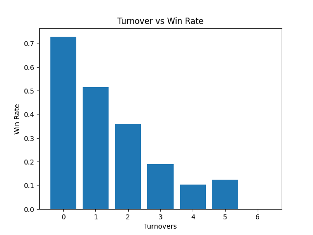
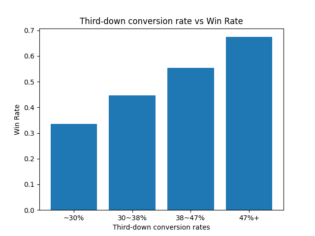

# NFL-analysis
NFL 경기 승패 요인 분석 프로젝트 

**핵심 발견: 승패를 가르는 건 턴오버(실책 방지)와 3rd down 전환율. 패스야드·페널티는 생각보다 영향이 작다.**

## 데이터
- 출처 : nfl_data_py (nflverse)
- 홈 어드밴티지·팀별 성적 : 2024~2025 정규시즌 (schedules)
- 턴오버·패스야드·페널티·3rd down : 2025시즌 정규시즌 544 팀-경기 (pbp)

## 분석 결과

### 홈 어드밴티지 
- 홈 승 291 / 원정 승 252 / 무승부 1
- 승률 : 53.5%
- 홈 승리 시 평균 12.3점 차, 패배 시 9.9점 차 
 
→ 홈 팀 승률 50% 이상, 이길 때 더 큰 점수차 // 2시즌 표본 : 추가 검증 필요

### 팀별 성적 (2024~2025 홈경기)
- 승수 상위: BUF 15승, DEN 14승, PHI·KC 13승
- 상위권은 실점이 낮은 팀에 몰림 (DEN 16.4로 최저)
- CIN: 득점 27.9(3위)에도 6승 → 실점 29.1이 상쇄

→ 공격력보다 수비력이 승수와 더 관련 있어 보임. 추가 검증 필요

### 턴오버와 승패 (2025시즌 기준)
- 진 팀 평균 1.61회 vs 이긴 팀 평균 0.7회 턴오버
- 턴오버 0회 승률 72.6% → 2회 30.0% → 3회 14.6%



→ 턴오버 수가 승률과 연결됨, 경기당 실책이 승패의 핵심 변수로 추정

### 패스야드와 승패 (2025시즌 기준)
- 패스야드 구간별 승률: 176야드 이하 42.6% → 176-221 47.7% → 221-272 54.4% → 272+ 54.8%
- 많이 던질수록 승률이 오르지만, 220야드 부근부터는 평평 (상단에서 차이 미미)

→ 패스야드는 승패와 연결되나, 턴오버보다 약한 요인. 지는 팀이 추격하며 패스를 늘리는 영향으로 추정

### 페널티와 승패 (2025시즌 기준)
- 진 팀 평균 6.54회 vs 이긴 팀 평균 6.23회 페널티 (차이 미미)
- 페널티 횟수별 승률: 실질 구간(3-8회)에서 43-58% 사이로 규칙 없이 오르내림
- 극단값(12회 이상)은 표본 부족(1-10경기)이라 신뢰 낮음

→ 페널티 횟수는 승패와 뚜렷한 관계 없음. 같은 실책이라도 공격권을 넘기는 턴오버와 달리, 야드만 손해보는 페널티는 영향이 작은 것으로 추정

### 3rd down 전환율과 승패 (2025시즌 기준)
- 전환율 구간별 승률: 30% 이하 34.1% → 30-38% 43.3% → 38-47% 57.9% → 47%+ 64.5%
- 전환율이 높을수록 승률이 끊김 없이 계속 상승 (하위-상위 30%p 차이)



→ 3rd down 전환율은 승패와 강하게 연결. 드라이브를 이어가는 능력이 곧 승리로 직결

### 요인 종합 비교 (승패와의 상관계수, 2025시즌)
- 턴오버: -0.396 (제일 강함, 많을수록 패배)
- 3rd down 전환율: +0.256 (두 번째, 높을수록 승리)
- 패스야드: +0.079 (약함)
- 페널티: -0.057 (거의 무관)

→ 승패의 핵심은 턴오버(실책 방지)와 3rd down 전환(드라이브 유지). 패스야드는 약하고, 페널티는 사실상 무관. 같은 실책이라도 공격권을 넘기는 턴오버는 치명적이지만, 야드만 잃는 페널티는 영향이 작다

## 실행 방법
- 최초 실행 시 nfl_data_py에서 pbp 데이터를 다운로드해 `nfl.db`(SQLite)에 저장
- 이후 실행은 `nfl.db`에서 바로 불러와 다운로드 없이 빠르게 동작
- `nfl.db`는 용량이 크고 재생성 가능하므로 git에 포함하지 않음 (코드만 있으면 자동 생성됨)

```bash
python explore.py
```